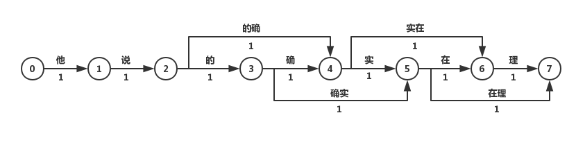
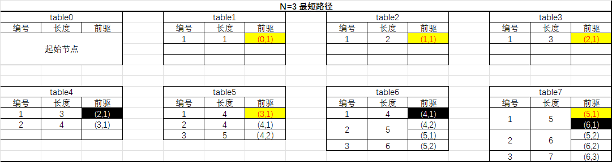
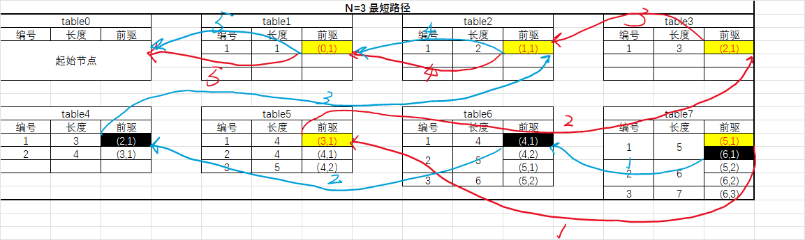
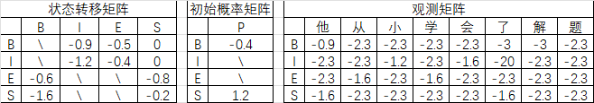
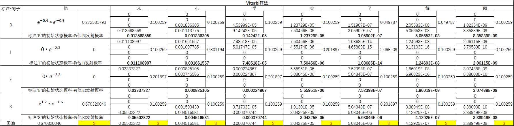
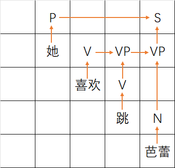
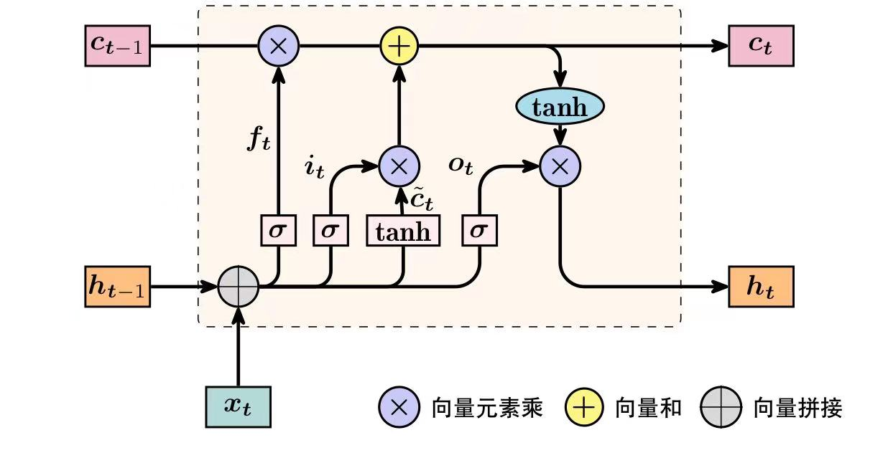
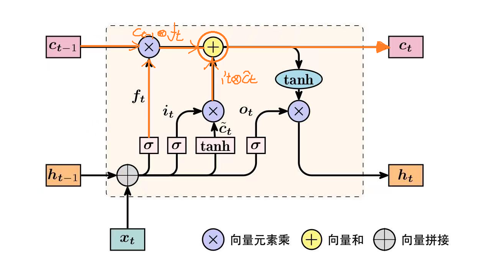

# 自然语言处理期末复习笔记

**作者：**Hongtauo

CSDN链接：[(27条消息) Hongtauo的博客_CSDN博客-笔记,实验题,NLP学习之路领域博主](https://blog.csdn.net/m0_53224245?spm=1000.2115.3001.5343)

GitHub：https://github.com/Hongtauo/NLP_notebook

**引用说明**

部分内容参考自如下链接，文章内容仅作为学习参考使用

[1] [关键词提取和摘要算法TextRank详解与实战 - 知乎 (zhihu.com)](https://zhuanlan.zhihu.com/p/126733456)

[2] 《LDA漫游指南》[arxiv.org/ftp/arxiv/papers/1908/1908.03142.pdf](https://arxiv.org/ftp/arxiv/papers/1908/1908.03142.pdf)

[3] [从0开始词嵌入（Word embedding） - 知乎 (zhihu.com)](https://zhuanlan.zhihu.com/p/422542949)

[4] [自然语言处理中N-Gram模型介绍 - 知乎 (zhihu.com)](https://zhuanlan.zhihu.com/p/32829048#:~:text=%20N-Gram%E6%98%AF%E4%B8%80%E7%A7%8D%E5%9F%BA%E4%BA%8E%E7%BB%9F%E8%AE%A1%E8%AF%AD%E8%A8%80%E6%A8%A1%E5%9E%8B%E7%9A%84%E7%AE%97%E6%B3%95%E3%80%82,%E5%AE%83%E7%9A%84%E5%9F%BA%E6%9C%AC%E6%80%9D%E6%83%B3%E6%98%AF%E5%B0%86%E6%96%87%E6%9C%AC%E9%87%8C%E9%9D%A2%E7%9A%84%E5%86%85%E5%AE%B9%E6%8C%89%E7%85%A7%E5%AD%97%E8%8A%82%E8%BF%9B%E8%A1%8C%E5%A4%A7%E5%B0%8F%E4%B8%BAN%E7%9A%84%E6%BB%91%E5%8A%A8%E7%AA%97%E5%8F%A3%E6%93%8D%E4%BD%9C%EF%BC%8C%E5%BD%A2%E6%88%90%E4%BA%86%E9%95%BF%E5%BA%A6%E6%98%AFN%E7%9A%84%E5%AD%97%E8%8A%82%E7%89%87%E6%AE%B5%E5%BA%8F%E5%88%97%E3%80%82%20%E6%AF%8F%E4%B8%80%E4%B8%AA%E5%AD%97%E8%8A%82%E7%89%87%E6%AE%B5%E7%A7%B0%E4%B8%BAgram%EF%BC%8C%E5%AF%B9%E6%89%80%E6%9C%89gram%E7%9A%84%E5%87%BA%E7%8E%B0%E9%A2%91%E5%BA%A6%E8%BF%9B%E8%A1%8C%E7%BB%9F%E8%AE%A1%EF%BC%8C%E5%B9%B6%E4%B8%94%E6%8C%89%E7%85%A7%E4%BA%8B%E5%85%88%E8%AE%BE%E5%AE%9A%E5%A5%BD%E7%9A%84%E9%98%88%E5%80%BC%E8%BF%9B%E8%A1%8C%E8%BF%87%E6%BB%A4%EF%BC%8C%E5%BD%A2%E6%88%90%E5%85%B3%E9%94%AEgram%E5%88%97%E8%A1%A8%EF%BC%8C%E4%B9%9F%E5%B0%B1%E6%98%AF%E8%BF%99%E4%B8%AA%E6%96%87%E6%9C%AC%E7%9A%84%E5%90%91%E9%87%8F%E7%89%B9%E5%BE%81%E7%A9%BA%E9%97%B4%EF%BC%8C%E5%88%97%E8%A1%A8%E4%B8%AD%E7%9A%84%E6%AF%8F%E4%B8%80%E7%A7%8Dgram%E5%B0%B1%E6%98%AF%E4%B8%80%E4%B8%AA%E7%89%B9%E5%BE%81%E5%90%91%E9%87%8F%E7%BB%B4%E5%BA%A6%E3%80%82)

[5] [【图文并茂】通过实例理解word2vec之Skip-gram - 知乎 (zhihu.com)](https://zhuanlan.zhihu.com/p/215797088)

[6] 《自然语言处理导论》——张奇、桂韬、黄萱菁

[7] 《Python自然语言处理实战》——涂铭、刘祥、刘树春

[8] [CRF++: Yet Another CRF toolkit (taku910.github.io)](https://taku910.github.io/crfpp/)

---

# 1.自然语言处理基础知识

学习一个新事物，肯定要先问问，这是什么？在知道这个事物的存在后，再问问这（它）是如何实现的，最后，光有理论知识可不行，还要想想它有什么用，能够用在哪些方面？对我们的生活有什么影响？

---

## 1.1什么是“自然语言处理”

### 1.1.1定义

自然语言处理（Natural Language Processing）是一门以计算机技术为基础的，对人类社会发展产生的“语言”进行处理、理解、运用，使得计算机能够理解人类语言并能使用人类语言进行生产活动的一门学科

### 1.1.2阐述

在人类社会的发展中，诞生了无数的用于交流的语言，在这些语言的推动下，各个文明发展愈来愈迅猛，人类的思维碰撞也愈来愈强烈，各种语言在国际大舞台上相互碰撞，相互吸收与学习，在人类文明历史的画卷中留下了经久不衰的璀璨，这份光荣而伟大的“发明”将伴随着人类文明继续发展，陪伴着人类续写文明的史诗。如果说，直立行走、解放双手、使用工具使得人开始有别于动物，那么语言就是人类区别于动物的根本标志，没有语言，人类的文明终究是沙漠中的繁星，闪耀却零散，而语言成功地将这些繁星变为人类文明的一砖一瓦，垒砌了辉煌而多样的文明。

## 1.2“自然语言处理”的任务是什么

自然语言处理的任务是将待处理的文本处理为不同的信息形式，这些信息从不同的层面表达文本的语义，自然语言处理的流程如下所示

### 1.2.1流程

* 一方面，人们根据语言专家的知识指定语言规则，计算机根据这些规则对文本进行加工和处理，即基于规则的自然语言处理
* 另一方面，基于机器学习的自然语言处理方法则需要先采集和收集语料，对语料进行人工标注，然后使用统计学习方法、机器学习方法和深度学习方法、让机器自动学习这些语料，构建出模型

### 1.2.2任务

* 句法语义分析
* 关键信息抽取
* 文本挖掘
* 机器翻译
* 信息检索
* 问答系统
* 对话系统
* 指代消解

## 1.3“自然语言技术”的基本分类

我们都说，学习的过程中要学会举一反三，在自然语言处理任务中，计算机程序同样也要面对这两个问题，即“理解”与“生成”。所谓“理解”，就是要让计算机程序能够明白用户在“说什么”，而所谓“生成”，就是计算机程序在“理解”了用户的需求后，能够将需求解决并反馈给用户，从而完成“人机交互”。

---

自然语言处理技术NLP可以分为两个方向：

1. 自然语言理解

    1. 音系学
    2. 词态学
    3. 句法学
    4. 语义句法学
    5. 语用学
2. 自然语言生成

    1. 生成自然语言文本

### 1.3.1自然语言理解

自然语言的理解就是要能让计算机程序理解用户“说了什么”，一般有三个分析层面：“词法分析”、“句法分析”、“语义分析”

#### 1.3.1.1词法分析

词法分析就是以词为分析句子的基本单元，内容包括“分词”与“词性标注”两个部分。

##### 分词

在汉语中，词以字为基本单位，但是文章的语义表达确是以词进行划分的，对中文文本中的句子转化到词的过程就是分词，通过计算机自动识别出句子的词并且使用符号加以划分，所以分词就是将连续的句子按一定的规则，切分为单个词汇的过程。

##### 1.3.1.2词性标注

词性标注的任务是为分词后的每一个词语赋予词性类别

#### 1.3.1.3句法分析

句法分析就是以句子为单位进行分析，得到句子结构的处理过程。分析句子的结构一方面是为了理解句子的含义，另一方面是为了进行更高级的自然语言处理任务，常见的分析方法包括短语结构句法分析和依存结构的句法分析。

#### 1.3.1.4语义分析

语义分析的目的是理解句子表达的真实语义。

### 1.3.2自然语言生成

自然语言生成是将以数字和符号表示的机器语言转换为自然语言的过程，可以运用在机器翻译、人机对话、看图说话等场景中

一般按照技术的难度进行划分，可以划分为以下三个级别

* 数据合并

  数据合并方法是自然语言生成的简化形式，将数据通过简单的对应关系转化成文本。通常情况下就是在一段文本中预留出空位，然后填入专用数据，这些专用数据具有相同的结构和用途，例如可以在工资表单中自动填入不同员工的姓名、身份证号、工资等
* 模板化

  通过预先定义好的模板与业务规则，采用模板驱动的方式生成文本，例如当前大部分的“智能语音助手”通过获取今日天气情况，自动生成“天气有雨，记得带伞”的模板化回答。
* 语义表达

  以语义表达为目的的自然语言生成方法更像人类，它能够理解上下文语义关系，将结果以人们可以轻松阅读和理的形式展现出来，表达方式更加灵活，表述能力更加强大，例如ChatGPT4.0

## 1.4“自然语言处理”能够应用在哪些领域

* 机器翻译
* 情感分析
* 智能问答
* 文摘生成
* 文本分类
* 舆论分析
* 知识图谱

# 2.中文分词技术

以英语为代表的印欧语系中词之间通常有分隔符来区分，词比较容易的从句子中进行提取，以汉语为代表的汉藏语系、以阿拉伯为代表的闪-含语系中句子之间通常没有明显的分隔符将词划分开，所以，针对汉语的自然语言处理首先要对句子中的词语进行划分。

### 2.1中文分词概述

#### 2.1.1定义

中文分词（Chinese Word Segmentation，CWS）是指将连续字序列转换为对应词序列的过程，也可也看作是在输入的序列中添加空格或其他边界标记的过程，其形式化表述如下

给定中文句子$c_1c_2c_3c_4,...,c_{n-1}c_n$，其中$C_i$为单个字符，输出词序列$w_1,w_2,w_3,...,w_m$，其中$w_j$为中文词汇

#### 2.1.2中文分词的困难

汉语的语素大部分是单个汉字，单独出现的时候可以作为词，不单独出现的时候又是构词成分，所以汉语的构词能力非常强大且灵活，对于新出现的事物不需要重新创造新的汉字，仅需使用当前的汉字进行组合即可得到新词，这同时也是中文分词工作的巨大挑战:

1. 分词规范

    汉语中对词的具体界定目前还未有定论，目前仅根据定性的描述来解释词的概念，而计算机难以直接处理定性的事物，不同研究机构给出的分词规范也有所不同，词在中文中的概念本身就是非常主观的（这也是作者认为中文非常唯美感性、可塑性强的原因，中华文化，博大精深！）比如，“羌笛何须怨杨柳，春风不度玉门关”这句出自唐代诗人王之涣的《凉州词》。传说中一位书法家为慈禧写这首诗，但是由于疏忽忘记写了一个“间”，慈禧大怒，这位书法家灵机一动，说道：这是臣用王之涣的诗句填的词啊！于是读到：黄河远上，白云一片，孤城万仞山。羌笛何须怨？杨柳春风，不度玉门关。由此可见，何为词？不同人可以给出不同的理解，而我们日常交流的时候也只是按照约定俗称的语言习惯进行，不会刻意在意词与字的关系。
2. 切分歧义

    1. 交集型切分歧义
    2. 组合型切分歧义
    3. 真歧义
3. 未登录词

    未登录词指的是在训练语料中没有出现或是词典中没有，但是在测试数据集合中出现的词，汉语具有非常强的灵活性，未登录词的情况也非常复杂，可以粗略的将汉语中的未登录词分为以下几个方面

    1. 新出现的普通词汇
    2. 专业名词
    3. 其他专有名词

### 2.2中文分词技术

#### 2.2.1基于词典的中文分词技术

1. N-最短路径法

    最短路径法进行分词的思想实际上是一种动态规划的思想，假设句子中两两词之间的距离为1，（如图）若从0->7存在一条最短路径{0，1，2，4，6，7}，其路径长度d=5，那么该最短路径中的子结构也是最短的，即{0->5}构成的路径{0，1，2，4，6}是最短的，以此类推。

    

    所以，我们可以对具有最优子结构的最短路径问题，采用动态规划算法或者贪心算法求解其最短路径

    1. 基于Dijkstra的最短路径分词算法

        Dijkstra算法采取的是贪心的策略，每次纳入一个距离分量最小的节点到节点集合中，递推地更新初始节点到当前节点的下一节点的距离。但是此算法在面对多条距离相同的路径的时候，其只保留其中一条。
    2. N-最短路径分词算法

        在算法的每一步只保留最短的N条路径，并记录这些路径上当前节点的前驱节点，当算法求得最优解的时候，进行回溯，求解得到最短路径。在画图的时候，需要从初始节点到末尾节点根据词典中给出的词构建有向无环图。

        **例题：**

        （暂时忽略词性）

        |词典|||
        | :-------------------------------: | ----------------------| ----------------------|
        |他|说|的|
        |确|实|在|
        |理|的确|确实|
        |实在|在理||

        1. 画出有向无环图

            
        2. 向前搜索（table的编号表示当前节点的最短路径情况，前驱节点用（n，m）表示，n代表前驱节点的编号，m表示此前驱节点出现的次数，值得注意的是，当长度相同时，两条路径应该放在同一个编号内，N最短的意思就是保留N条最短的路径，此处N=3，所以保留3条最短的路径（相等的看成一条））

            
        3. 回溯（纠正：table5中的长度为4的应该要放一起）

            
2. 最大匹配法

    最大匹配法包含 前向最大匹配，后向最大匹配以及双向最大匹配

    1. 前向最大匹配

        1. 对于需要分词的句子Sentence，从左到右取m个字符作为切分字段，m为词典中最大的字符串长度

        2. 对于该字段在字典中进行查词匹配，若匹配成功，则将该字段作为一个词切分出来，若匹配不成功，则将该字段最末尾的一个字去掉，将剩下的字段作为新的字段重复“2”操作，直到切分完所有词
    2. 后向最大匹配

        1、对于需要分词的句子Sentence，从右到左取m个字符作为切分字段，m为词典中最大的字符串长度

        2、对于该字段在字典中进行查词匹配，若匹配成功，则将该字段作为一个词切分出来，若匹配不成功，则将该字段最末尾的一个字去掉，将剩下的字段作为新的字段重复“2”操作，直到切分完所有词
    3. 双向最大匹配

        双向最大匹配算法实际上是将正向最大匹配算法与逆向最大匹配算法得到的结果进行比较，选择词数切分最少的作为结果

    **例题：**

    假设字典为{“轻工业”，“工业”，“质量”，“产品”，“大幅度”，“提升”，“年轻”}

    现有句子：“2013年轻工业产品质量大幅度提升”

    1. 正向匹配：

        字典中字符串最大长度为“3”，从左往右取3个字符进行切分，若不在字典中出现，则去掉末尾的一个字，重复此操作

        {201} nofound , m--

        {20} nofound , m--

        {2} nofound && length == 1 ，cut the word

        2 {013} nofound , m--

        {01} nofound , m--

        {0} nofound && length == 1 ，cut the word

        ......

        2/0/1/3 {年轻工}

        {年轻工} nofound , m--

        {年轻} found , cut the word

        ......

        2/0/1/3/年轻/工业/产品/质量/大幅度/提升
    2. 逆向匹配

        2/0/1/3/年/轻工业/产品/质量/大幅度/提升
    3. 双向匹配

        取切词数量最少的

#### 2.2.2基于规则的中文分词技术

基于规则的中文分词方法根据语言学规则对句子中包含的词义信息进行分析，通过人为设定的一组规则来建立推理机和知识库，从而识别中文语句中的词语边界

#### 2.2.3基于统计的中文分词技术

基于统计的中文分词实际上是把分词的过程看作是字的分类，我们先规定，对于每个字，在构词的时候都有可能处在以下位置：{B,I,E,S}

在{B,I,E,S}标签表示法中

* B表示字处于词的开头位置
* I表示字处于词的中间位置
* E表示字处于词的结尾位置
* S表示字单独成词

举个例子，对“自然语言”的分词如下：“自然”“语言”，那么对应的标记为“自/B然/S”，“语/B言/S”

所以{B,I,E,S}标签表示法将分词任务变为字的分类问题，故中文分词任务也是典型的序列标注问题，其核心思想是通过统计的方法，通过统计相连字在文本中出现的频率来估计相连的字组成词的概率，当组合的概率（频度）高于某一个临界值得时候，便认为该组合很有可能会构成一个词语

1. **隐马尔可夫模型HMM**

    * 贝叶斯公式

      $P(A|B)=\frac{P(AB)}{P(B)}=\frac{P(B|A)P(A)}{P(B)}$  

       虽然贝叶斯的形式已经给出，一眼看过去很清晰的知道等式的左项表示：在B条件下A发生的概率，但是我们并没有办法了解它的显示含义，所以我们对上式进行处理，赋予上式一种解释：

      ①H表示假设：我们将A用H替代

      ②D表示已掌握的数据：将B用D替代

      那么我们可以很容易的得到如下式子：

      $P(H|D)=\frac{P(HD)}{P(D)}=\frac{P(D|H)P(H)}{P(D)}$  

      对于句子“他从小学会了解题”，我们**假设**这句话的分词标注为“他/S 从/B 小/E 学/B 会/E 了/S 解/B 题/E”，这样，我们得到了假设H：

      D：{“他从小学会了解题”}

      H：{“SBEBESBE”}

      我们想要知道这种假设的发生概率是多大，也就是求$P(H|D)$，在模式识别-贝叶斯一章中我们已经了解到，一个假设其后验概率最大，其越有可能发生，在统计分词中也是如此，只要我们检查每个假设的后验分布，当假设的后验分布足够大，表示按此假设分词的可能性也就越大。

      将上述假设H（注意，H只是所有假设中的其中一个）带入我们的贝叶斯公式：

      $P({“SBEBESBE”}|{“他从小学会了解题”})=\frac{P({“SBEBESBE”}{“他从小学会了解题”})}{P({“他从小学会了解题”})} \\ =\frac{P({“他从小学会了解题”}|{“SBEBESBE”})P({“SBEBESBE”})}{P({“他从小学会了解题”})}$  

      现在，我们的难点就从计算假设的“后验概率”简化为计算假设的“条件概率”与假设的“先验分布”，但是，这看起来还是有难度。
    * HMM模型

      HMM模型的提出就是为了解决上述问题条件概率的求解困难，同时引入了状态转移概率，解决了部分不可能出现的标注情况

      为了方便展示字与字、标注与标注、标注与字之间的关系，对于假设H，我们使用一连串的o表示标签，即$o=o _{1}o_{2}...o_{n}$。对于句子D我们使用$\lambda=\lambda _{1}\lambda _{2}...\lambda_{n}$表示。

      $$
      P({“SBEBESBE”}|{“他从小学会了解题”})=P(o|\lambda)=\frac{P(\lambda|o)P(o)}{P(\lambda)}\Longleftrightarrow P(\lambda|o)P(o)
      $$

      由于$P(\lambda)$是全概率公式，计算结果为常数，我们可以让后验概率等价于条件概率与先验分布的乘积

      * 对$P(\lambda|o)P(o)$做马尔可夫假设

        $P(\lambda|o)=P(\lambda_{1}|o_{1})P(\lambda_{2}|o_{2})...P(\lambda_{n}|o_{n})$  

        也就是每个标注对应于一个字的概率，$P(\lambda_n|o_n)$叫做发射概率
      * 对$P(o)$做其次马尔可夫假设

        $P(o)=P(o_{1})P(o_{2}|o_{1})P(o_{3}|o_{2})...P(o_{n}|o_{n-1})$  

        也就是当前状态仅与前一个状态有关。其中$P(o_1)$表示初始状态概率向量，$P(o_n|o_{n+1})$为状态转移概率，通过认为设置某些状态转移概率为0，即可杜绝不合理的状态组合，比如“BBB”类似的组合

      综上，我们终于解决了计算的难题，我们得到了如下的公式：

      $$
      P(o|\lambda)= P(\lambda|o)P(o)=P(\lambda_{1}|o_{1})P(\lambda_{2}|o_{2})...P(\lambda_{n}|o_{n})P(o_{1})P(o_{2}|o_{1})P(o_{3}|o_{2})...P(o_{n}|o_{n-1})
      $$

      调整下次序

      $$
      P(o|\lambda)= P(\lambda|o)P(o)=P(o_{1})P(\lambda_{1}|o_{1})P(o_{2}|o_{1})P(\lambda_{2}|o_{2})P(o_{3}|o_{2})......P(o_{n}|o_{n-1})P(\lambda_{n}|o_{n})
      $$

      **示例：**

      基于上面的例子，我们可以这样计算$P({“SBEBESBE”}|{“他从小学会了解题”})$  

      $P({“SBEBESBE”}|{“他从小学会了解题”})=P(S)P(他|S)P(B|S)P(从|B)P(E|B)P(小|E)P(B|E)P(学|B)P(E|B)P(会|E)P(S|E)P(了|S)P(B|S)P(解|B)P(E|B)P(题|E)$
    * Viterbi算法求解概率最大的标注序列与分词结果

      假设状态转移概率矩阵、初始概率矩阵、观测矩阵概率如下所示

      

      使用维特比算法求解句子的标注

      
2. 条件随机场CRF

    [CRF++: Yet Another CRF toolkit (taku910.github.io)](https://taku910.github.io/crfpp/)
3. 长短时记忆网络

    参考：《自然语言处理导论》——张奇、桂韬、黄萱菁

#### 2.2.4基于机器学习方法的中文分词技术

参考：《自然语言处理导论》——张奇、桂韬、黄萱菁

### 2.3中文分词的评价

参考;《自然语言处理导论》——张奇、桂韬、黄萱菁

# 3.关键词提取技术

关键词就是能够代表文章重要内容的一组词，对文本聚类、分类、自动摘要等起重要的作用。关键词提取算法也分为两类，即有监督的和无监督的，本章重点讲解无监督的关键词提取算法。

|优劣\算法|有监督的关键词提取技术|无监督的关键词提取技术|
| -----------| --------------------------------| :------------------------------: |
|优势|高精度|人工维护成本低，对数据的要求低|
|劣势|人工维护成本高。难以适应新信息|精度稍差|

---

## 3.1TF-IDF算法

TF/IDF算法是一种基于统计的计算方法，常常用于评估在一个文档集中，一个词对某份文档的重要程度，TF-IDF算法实际上是两个算法的融合，对单个的TF或IDF算法来说，效果可能不那么好，将其进行融合，即可取长补短，提高算法的提取能力。

1. TF算法

    TF算法也叫做词频算法（Term Frequency），其思想是，如果一个词是文章的关键词，那么他一定在文章中频繁的出现，其函数定义如下：

    $$
    tf_{ij}=\frac {n_{ij}}{\textstyle \sum_{k}^{} n_{kj}}
    $$

    也就是，词频tf = 某个词在文章中出现的次数/该文章的总词数
2. IDF算法

    IDF算法的思想是，如果一个词他在这篇文章中频繁的出现，但是在整个文档集合中他在其他文档中很少出现，那么这个词就是这篇文章的关键词，从算法思想中不难看出，IDF算法他力求找到一个词，不但能代表整篇文章，还能够将这篇文章与其他文章区分开来。

    其函数定于如下：

    $$
    idf_i=log(\frac{|D|}{1+|D_i|})
    $$

    也就是，逆文档词频idf = log(语料库的文档总数/包含该词的文档数+1)

    分母加1的原因是，可能有些文档不包含这个词，为了避免计算错误，进行平滑处理，根据算法，我们可以看出，如果一个词在越多篇文章中出现，其分母就越大，分数值越小，经过log函数处理后，整体的idf值就越小（log函数的作用是压缩变化的尺度，使得变化激烈的变量运算结果表现得缓和，避免算法对某些数据产生偏好，同时也方便计算）
3. TF-IDF的结合

    对于如何将TF与IDF进行组合，经过学者的大量研究，最终发现相乘是最有效的计算方式，即

    $$
    tf\times idf(i,j)=tf_{ij}\times idf_i=\frac {n_{ij}}{\textstyle \sum_{k}^{} n_{kj}}\times log(\frac{|D|}{1+|D_i|})
    $$

## 3.2PageRank、TextRank算法

PageRank算法是一种网页排名算法，其基本思路如下：

* 链接数量：一个网页被越多的其他网页连接，说明这个网页越重要
* 链接质量：一个网页被一个越高权值的网页链接，表明这个网页越重要

TextRank算法是可以脱离语料库的背景，仅对单篇文档进行分析就可以提取该文档的关键词，最早用于文档的自动摘要，基于句子维度的分析，利用TextRank对每个句子进行打分。挑选出分数最高的n个句子作为文档的关键句，以达到自动摘要的效果。

---

### 3.2.1PageRank

衡量一个网页的PageRank值的计算公式为

$$
S(V_i)=\textstyle \sum_{j∈In(V_i)} \left ( \frac{1}{|Out(V_j)|} \times S(V_j) \right)
$$

公式中的$In(V_i)$为$V_i$的入链集合，$Out(V_j)$为$V_j$的出链集合，$|Out(V_j)|$为出链的数量，每个网页要将自己的分数平均地贡献给每个出链接，则$\frac{1}{|Out(V_j)|} \times S(V_j)$即为$V_j$贡献给$V_i$的分数。将$V_i$的所有的入链贡献给他的分数累加，就是$V_i$自身的分数。

算法初始时会将所有网页的得分初始化为1，然后通过多次迭代来对每个网页的分数进行收敛，收敛时得到的得分就是网页的最终得分，若不能收敛，则设定最大迭代次数，超过此次数后计算停止，此时的分数就是网页的得分。

为了避免出现某些网页因为没有出链和入链的得分为0的情况，对公式进行改造，加入阻尼系数d

$$
S(V_i)=(1-d)+d \times \textstyle \sum_{j∈In(V_i)} \left ( \frac{1}{|Out(V_j)|} \times S(V_j) \right)
$$

### 3.2.2TextRank

可以通过图的角度理解PagrRank

指路：[关键词提取和摘要算法TextRank详解与实战 - 知乎 (zhihu.com)](https://zhuanlan.zhihu.com/p/126733456)

## 3.3LSA/LSI/LDA算法

在学习LSA/LSI/LDA之前，首先要了解BOW(Bag Of Word)词袋模型的概念

### 3.3.1词袋模型

词袋模型就是将所有文件中的词抽取出来形成一张词汇清单，然后基于这份清单对每个文件进行矢量化表示

**例题：**

P1：我在广州上大学

P2：我在广州大学上大学

词汇清单：{“我”，“在”，“北京”，“广州”，“上”，“大学”}

P1的词袋向量为：[1，1，0，1，1，1]

P2的词袋向量为：[1，1，0，1，1，2]

### 3.3.2LSA/LSI算法

LSA和LSI分别指的是潜在语义分析和潜在语义检索，两者的算法没有什么区别，只是应用场景的不同

LSA算法步骤如下：

1. 使用BOW模型将每个文档表示为向量
2. 将所有文档的向量拼接起来构成词-文档矩阵
3. 对词-文档矩阵进行奇异值分解（SVD）操作
4. 根据奇异值分解的结果将词-文档矩阵映射到一个更低维度的近似SVD结果，每个词和文档都可以表示为k个主题构成的空间中的一个点，通过计算每个词和文档的相似度，可以得到每个文档中每个词的相似度结果，取相似度最高的一个词即为文档的关键词

LSA的缺点：

* 奇异值分解的物理含义不明确，难以确切地表达矩阵特征值缩减到底代表了什么含义

* SVD的时空复杂度很高

### 3.3.3LDA算法

LDA算法的基础是贝叶斯理论，LDA根据词的共现信息的分析，拟合出词-文档-主题的分布，将词、文本都映射到一个语义空间中

参考：《统计机器学习（第二版）》，《LDA漫游指南》、《LDA数学八卦》

指路：[arxiv.org/ftp/arxiv/papers/1908/1908.03142.pdf](https://arxiv.org/ftp/arxiv/papers/1908/1908.03142.pdf)

# 4.文本分类

# 5.句法分析

句法分析的主要任务是：识别出句子所包含的句法成分以及这些成分之间的关系，一般以句法树来表示

## 5.1成分语法

以获取整个句子的句法结构或者完全短语结构为目的的句法分析，称为成分结构分析或短语结构分析。

由于成分语法就是由句法范畴和短语结构规则定义的语法，具有递归性，使得短语和句子无限循环组合，层级关系可以用语法树来表示，而由于成分语法局限于句子的表层结构，不能够彻底解决语法和语义的问题，因此存在非连续成分，结构歧义等的问题。

### 5.1.2上下文无关文法CFG

定义：给定上下文无关文法G的情况下，对于给定的句子$W={w_1,w_2,...,w_n}$，可以使用两类搜索算法：自顶向下和自底向上。

* 自顶向下的搜索方法试图从根节点S出发，搜索语法中的所有规则直到叶子结点，并行构造所有可能的树
* 自底向上的方法是从输入的单词开始，每次都用语法规则，直到成功构造了以初始符S为根的树

#### 5.1.2.1CYK算法

CYK是一种基于动态规划思想的，自底向上的语法分析算法，要求所使用的语法必须符合乔姆斯基范式（CNF），任何上下文无关文法都可以转换为相应的CNF语法。

根据CNF语法形式，句法树的叶子节点为单词，单词的父节点为词性符号，在词性符号层之上的每一个非终结点都有两个子节点，CYK算法采用了二维矩阵对整个树结构进行编码，矩阵主对角线以下的元素全为0，主对角线上的元素为句子的终结符——词，然后按照平行于主对角线上的方向，逐层向上填写矩阵中的各个元素，且必须要保证S只出现在$T_{0,n}$处（也就是矩阵的最右上角）

**例子：**

非终结符：N={S,N,P,V,VP}

终结符：{她，喜欢，跳，芭蕾}

规则集合{S→P VP    ,    VP→ V V    ,    VP→VP N    ,    P→她    ,    V→喜欢    ,    V→跳    ,    N→芭蕾  }

#### 5.1.2.2移进-归约分析算法

移进-归约分析算法的基本思想是从左向右扫描输入的包含残次词性对的句子，使用堆栈和一系列的移进、归约操作构建句法树。

算法开始时堆栈S为空，队列Q中包含整个句子所有的单词，算法结束后，队列Q为空，堆栈S为一颗完整的句法树

算法包含的四个操作：

* 移进

  将非空队列的最左端的单词移动到堆栈中
* 归约

  根据规则将栈底的相应元素取出，归约而成的新结构压入栈中
* 接收

  队列为空，堆栈中仅剩一个以非终结符S为根的树
* 拒绝

  队列为空，堆栈中并非只有一个以非终结符S为根的树，且无法继续归约

采取的搜索策略：

由于移进和归约是不完全互斥的，这就造成了移进-归约冲突，可以采取一些搜索策略

* 深度优先
* 回溯

### 5.1.3基于概率的上下文无关文法PCFG

句法分析概率计算是指在给定的PCFG文法G、句子$W={w_1,w_2,...,w_n}$以及语法树T的情况下，计算句法分析树的概率$P(T)$，为了简化句法概率计算，要做出三个独立假设：

* 位置不变性：子树的概率不依赖于该子树所在的位置
* 上下文无关性：子树的概率不依赖于子树以外的单词
* 祖先无关性：子树的概率不依赖于子树的祖先节点

基于独立性假设，句法树T的概率定义为该句法树T中用来得到句子W所使用的m个规则的概率乘积：

$$
P(T)=\prod_{i=1}^{m}P(A_i→α)
$$

## 5.2依存语法

以获取局部成分为目的的句法分析，被称为依存分析

注：本章参考《自然语言处理导论》——张奇、桂韬、黄萱菁

# 6.文本向量化（词嵌入）

指路：[从0开始词嵌入（Word embedding） - 知乎 (zhihu.com)](https://zhuanlan.zhihu.com/p/422542949)

## 6.1词集词袋模型

1. 词集模型

    将文章中所有出现的词（去除重复出现的词）构成一个表，对与每篇文章，依次将文章转换为向量，即从词集的第一个词遍历到最后一个词，若该词在本文中出现，则其向量设置为1，反之设置为0

    例子：

    句子A：我喜欢看电视，不喜欢看电影

    句子B：我不喜欢看电视，也不喜欢看电影

    分词结果：

    句子A：我/喜欢/看/电视，不/喜欢/看/电影

    句子B：我/不/喜欢/看/电视，也/不/喜欢/看/电影

    词表：{我，喜欢，看，电视，不，电影，也}

    转换为向量表示

    句子A：[1,1,1,1,1,1,0]

    句子B：[1,1,1,1,1,1,1]
2. 词袋模型

    词袋模型就和前面章节描述的一样，词袋和词集的不同点在于，词袋是将词出现的次数作为向量，而词集是将出现该词则赋予1，否则赋予0作为向量

## 6.2N-gram

指路：[自然语言处理中N-Gram模型介绍 - 知乎 (zhihu.com)](https://zhuanlan.zhihu.com/p/32829048#:~:text=%20N-Gram%E6%98%AF%E4%B8%80%E7%A7%8D%E5%9F%BA%E4%BA%8E%E7%BB%9F%E8%AE%A1%E8%AF%AD%E8%A8%80%E6%A8%A1%E5%9E%8B%E7%9A%84%E7%AE%97%E6%B3%95%E3%80%82,%E5%AE%83%E7%9A%84%E5%9F%BA%E6%9C%AC%E6%80%9D%E6%83%B3%E6%98%AF%E5%B0%86%E6%96%87%E6%9C%AC%E9%87%8C%E9%9D%A2%E7%9A%84%E5%86%85%E5%AE%B9%E6%8C%89%E7%85%A7%E5%AD%97%E8%8A%82%E8%BF%9B%E8%A1%8C%E5%A4%A7%E5%B0%8F%E4%B8%BAN%E7%9A%84%E6%BB%91%E5%8A%A8%E7%AA%97%E5%8F%A3%E6%93%8D%E4%BD%9C%EF%BC%8C%E5%BD%A2%E6%88%90%E4%BA%86%E9%95%BF%E5%BA%A6%E6%98%AFN%E7%9A%84%E5%AD%97%E8%8A%82%E7%89%87%E6%AE%B5%E5%BA%8F%E5%88%97%E3%80%82%20%E6%AF%8F%E4%B8%80%E4%B8%AA%E5%AD%97%E8%8A%82%E7%89%87%E6%AE%B5%E7%A7%B0%E4%B8%BAgram%EF%BC%8C%E5%AF%B9%E6%89%80%E6%9C%89gram%E7%9A%84%E5%87%BA%E7%8E%B0%E9%A2%91%E5%BA%A6%E8%BF%9B%E8%A1%8C%E7%BB%9F%E8%AE%A1%EF%BC%8C%E5%B9%B6%E4%B8%94%E6%8C%89%E7%85%A7%E4%BA%8B%E5%85%88%E8%AE%BE%E5%AE%9A%E5%A5%BD%E7%9A%84%E9%98%88%E5%80%BC%E8%BF%9B%E8%A1%8C%E8%BF%87%E6%BB%A4%EF%BC%8C%E5%BD%A2%E6%88%90%E5%85%B3%E9%94%AEgram%E5%88%97%E8%A1%A8%EF%BC%8C%E4%B9%9F%E5%B0%B1%E6%98%AF%E8%BF%99%E4%B8%AA%E6%96%87%E6%9C%AC%E7%9A%84%E5%90%91%E9%87%8F%E7%89%B9%E5%BE%81%E7%A9%BA%E9%97%B4%EF%BC%8C%E5%88%97%E8%A1%A8%E4%B8%AD%E7%9A%84%E6%AF%8F%E4%B8%80%E7%A7%8Dgram%E5%B0%B1%E6%98%AF%E4%B8%80%E4%B8%AA%E7%89%B9%E5%BE%81%E5%90%91%E9%87%8F%E7%BB%B4%E5%BA%A6%E3%80%82)

N-gram模型是使用一个大小为N的窗口，在文本内容上滑过，将窗口内的词作为一个片段，最终的到一组长度为N的字片段序列，可以理解为N的大小决定了当前词与前后文的关系，对句子切片后按照词库统计词频

假设句子为：“我爱中国”

（一元模型）N=1：[我]，[爱]，[中]，[国]

（二元模型）N=2：[我爱]，[爱中]，[中国]

（三元模型）N=3：[我爱中][爱中国]

如何计算一个自然语言句子出现的概率？由朴素贝叶斯公式与链式法则可知

$$
P(\omega_{1},\omega_{2},\omega_{3}...\omega_{m})=P(\omega_{1})P(\omega_{2}|\omega_{1})P(\omega_{3}|\omega_{1},\omega_{2})...P(\omega_{i}|\omega_{1},\omega_{2},\omega_{3},...,\omega_{i-1})...P(\omega_{m},\omega_{1},\omega_{2},\omega_{3},...,\omega_{m-1})
$$

即每个词的出现都和该词之前的所有词有关联，我们的发现，当文本过长的时候，公式变得非常难计算，于是有学者提出了N元模型的概念，N代表当前词与此前出现的词的关系，也就是句子的语序信息，N=1的时候叫做一元模型，N=2的时候叫做二元模型，n越大，保留的句子的次序信息就越丰富，计算的开销也越高。

比如：对该假设应用N=2的模型，我们可以得到这个句子的概率P(H)

$$
P(我爱中国)=P(我)P(爱|我)P(中|爱)P(国|中)
$$

是不是感觉和前面的HMM很相似，其实这里也是一样的道理，我们假设每个词出现的概率只和该词之前的词有关系，这个概率就是$P(word_{i}|word_{i-1})$，也就是状态转移概率。

假设我们的词库中的词为{”吃“，”喝“，”饭“，”水“}，经过对大量文章的统计，我们得到了$P(饭|吃) = 0.91$，$P(水|喝)=0.92$，那么我们就能很快确定，一般情下，”吃“后面应该跟着”饭“，而不是”水“。

仔细观察淘宝等电商的搜索框，当你打算购买一个产品，比如”椰子水“，当你输入”椰“的时候，下拉菜单会出现一系列的猜你喜欢，比如”椰子水“，”椰乳“，”椰浆“，”椰子脆“，根据你的历史搜索、个人资料和一系列的骚操作计算这些词出现的概率，这样电商平台会按照你的喜好对下拉菜单中出现的内容进行降序排序，确保出现在前排的都是你感兴趣的。

## 6.3TF-IDF

TF-IDF前面已经介绍过了，故不再赘述

## 6.4One-Hot

One-Hot也叫独热编码，通过设置N个状态位，对于每个状态有且仅有一位状态位为有效状态位，比如”我爱中国“，假设每个字作为一个状态，得到的编码应该是这样的

我[1,0,0,0]

爱[0,1,0,0]

中[0,0,1,0]

国[0,0,0,1]  

我们可以想象一下，当状态特别多的时候，所得到的一个状态矩阵是一个极其稀疏的矩阵，在分词任务中，词典中的每个词都是一个状态，句子由词的出现与否构成（在文本任务的特征提取上也就是词袋模型）

## 6.5相似度

1. 欧氏距离

    ‍
2. 曼哈顿距离

    ‍
3. 切比雪夫距离

    ‍
4. 明可夫斯基距离

    ‍
5. 标准化欧氏距离

    ‍
6. 马氏距离

    ‍
7. 余弦距离

    ‍
8. 汉明距离

    ‍
9. 杰卡德距离

    ‍
10. 相关距离

     ‍
11. 信息熵

     ‍
12. K-L距离

## 6.6从OneHot到Word2Vec理解skip-gram、CBOW

指路：[【图文并茂】通过实例理解word2vec之Skip-gram - 知乎 (zhihu.com)](https://zhuanlan.zhihu.com/p/215797088)

# 7.LSTM

LSTM也叫长短时记忆网络，是循环神经网络的一个变体，可以在一定程度上缓解单循环神经网络出现的梯度消失和梯度爆炸的问题

注：插图来源于《自然语言处理导论》——张奇、桂韬、黄萱菁

**符号解释**

$c_t$：网络的内部状态

$h_t$：外部状态

$f_t$：遗忘门

$i_t$：输入门

$o_t$：输出门

$\tilde{c_t}$：候选状态

如图结构所示，网络将上一时刻的外部状态$h_{t-1}$与当前时刻的输入$x_t$，进行向量拼接，然后通过遗忘门$f_t$控制上一时刻的内部状态$c_{t-1}$需要遗忘掉多少信息，通过输入门$i_t$控制当前时刻的候选状态$\tilde{c_t}$中需要保留多少信息，然后通过输出门$o_t$控制当前时刻内部状态$c_t$需要输出多少信息给外部状态$h_t$，显而易见，长短时记忆网络使用了门控机制，有效的传递和表达长时间序列中的信息，而且句子中并非所有的关键信息都是等权重的，长短时记忆网络可以记住“被需要的信息”而忽略“不必要的信息”。

门控公式：

* 遗忘门

  $f_t=σ(W_f*x_t+U_fh_{t-1}+b_f)$

* 输入门

  $i_t=σ(W_i*x_t+U_ih_{t-1}+b_i)$

* 输出门

  $o_t=σ(W_o*x_t+U_oh_{t-1}+b_o)$

状态公式

* 候选状态

  $\tilde{c_t}=tenh(W_c*x_t+U_ch_{t-1}+b_c)$
* 内部状态

  $c_t=f_t\otimes c_{t-1}+i_t\otimes \tilde{c_t}$  

  
* 输出外部状态

  $ht=o_t\otimes tanh(c_t)$

# 8.NLP应用领域

* 机器翻译
* 情感分析
* 智能问答
* 文摘生成
* 文本分类
* 舆论分析
* 知识图谱

‍

‍

‍

‍

‍
